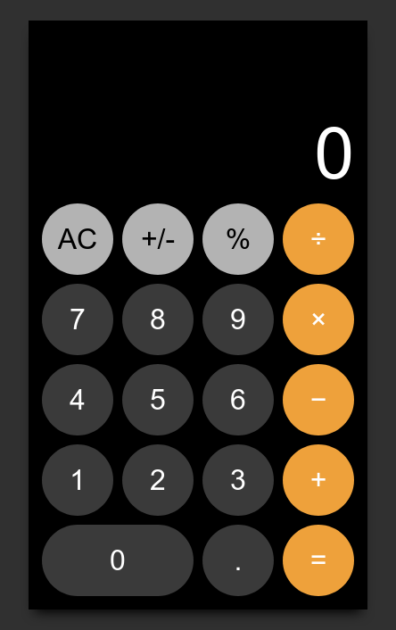

# Simple Calculator

## 🚀 Getting started

### Prerequisites

1.  [Git](https://git-scm.com/downloads).
1.  [Node](https://nodejs.org/en/download/) _(version 12 or greater)_.
1.  A clone of this repo (`simple-calculator`).

### Installation

1.  `cd simple-calculator` to go into the project root.
1.  `npm install` to install the dependencies.

### Running Locally

1.  `npm start` to start the development server.
1.  `open http://localhost:3000/` in your browser.

### Available Scripts

1.  `npm run build` to build production version of this project.
1.  `npm test -- --watchAll=false` to run all tests.
